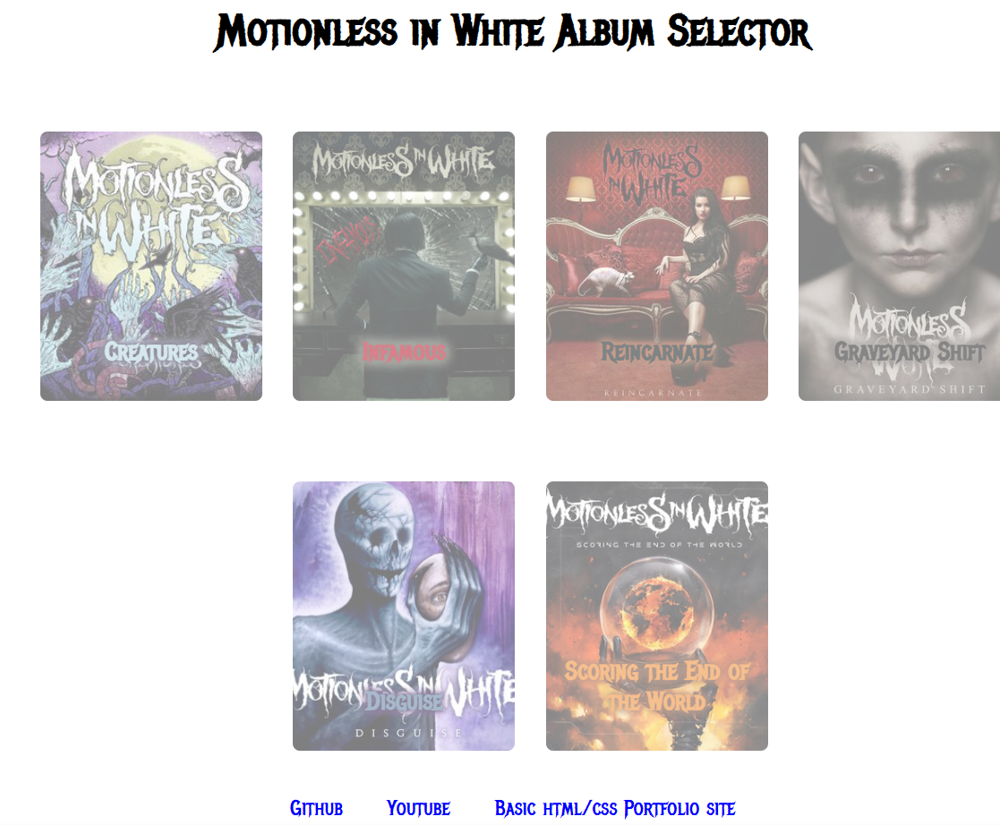
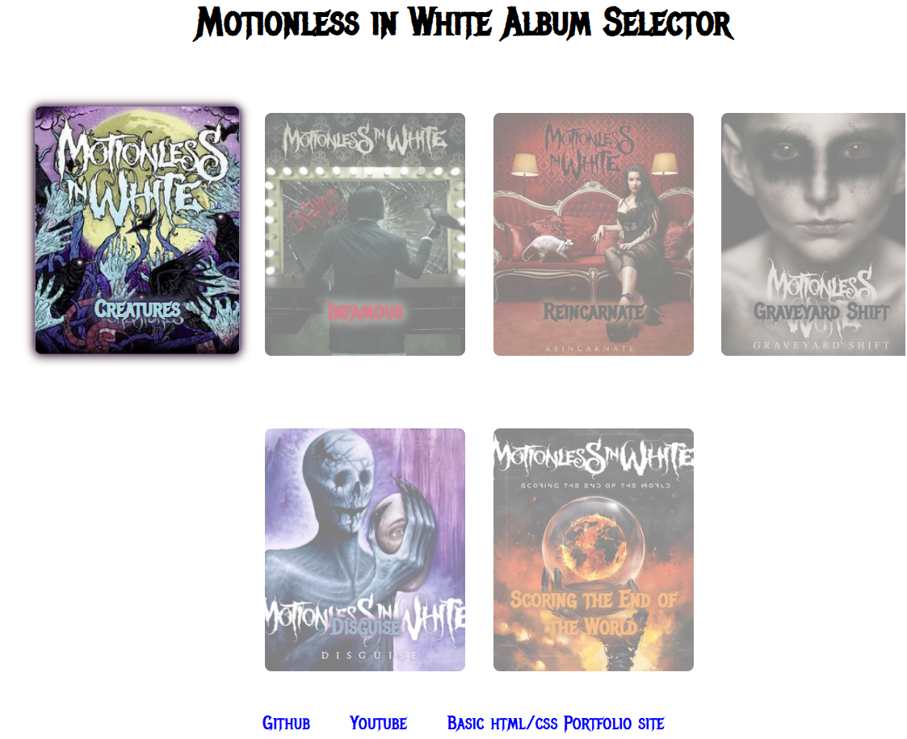
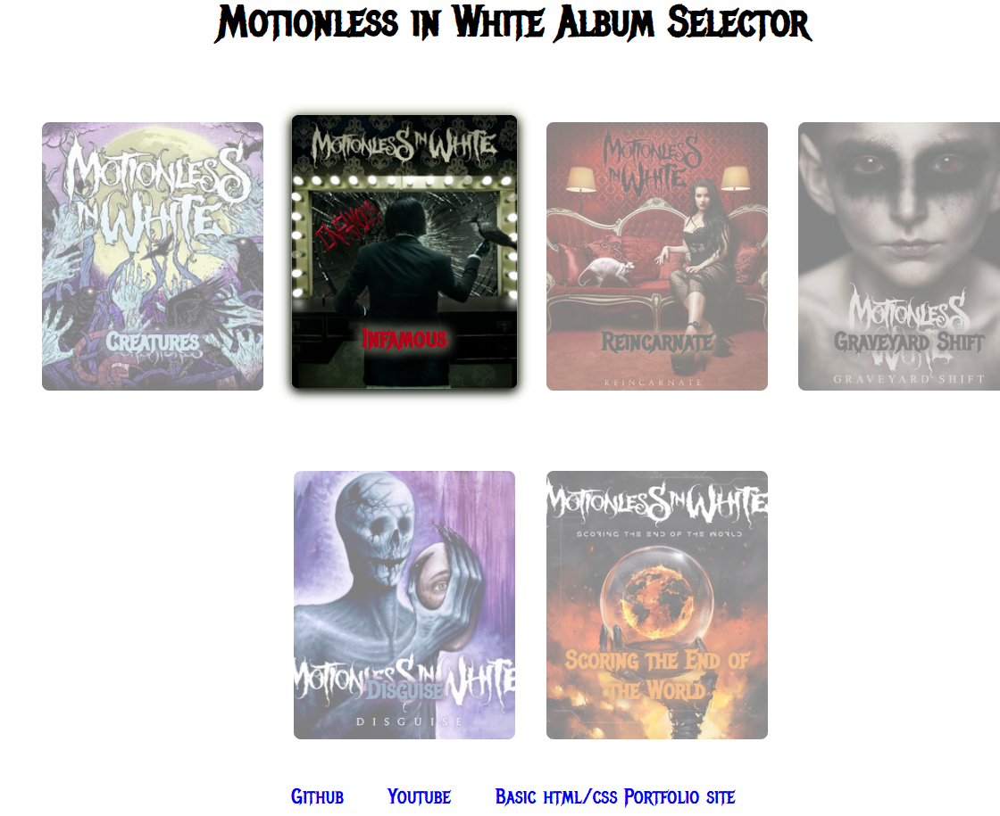
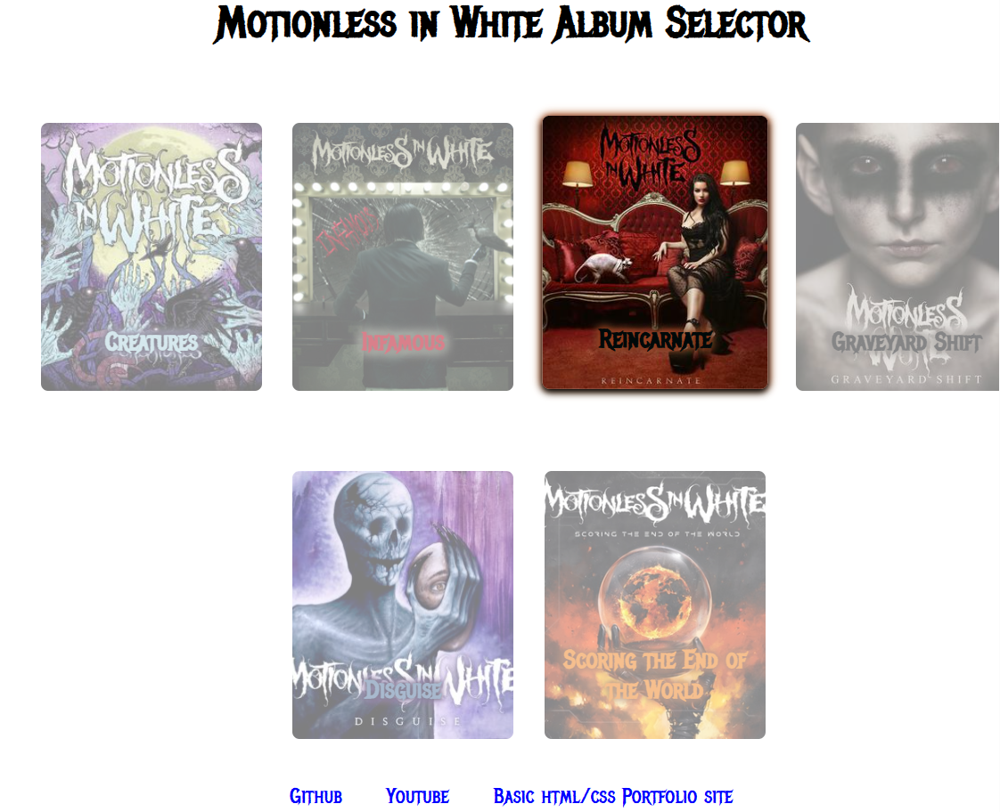
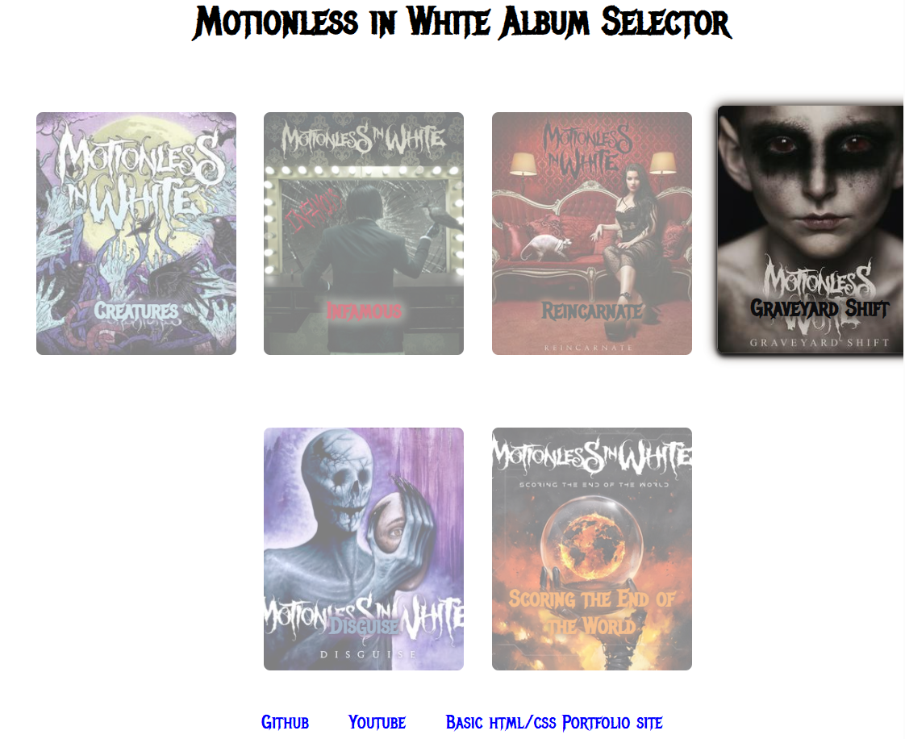
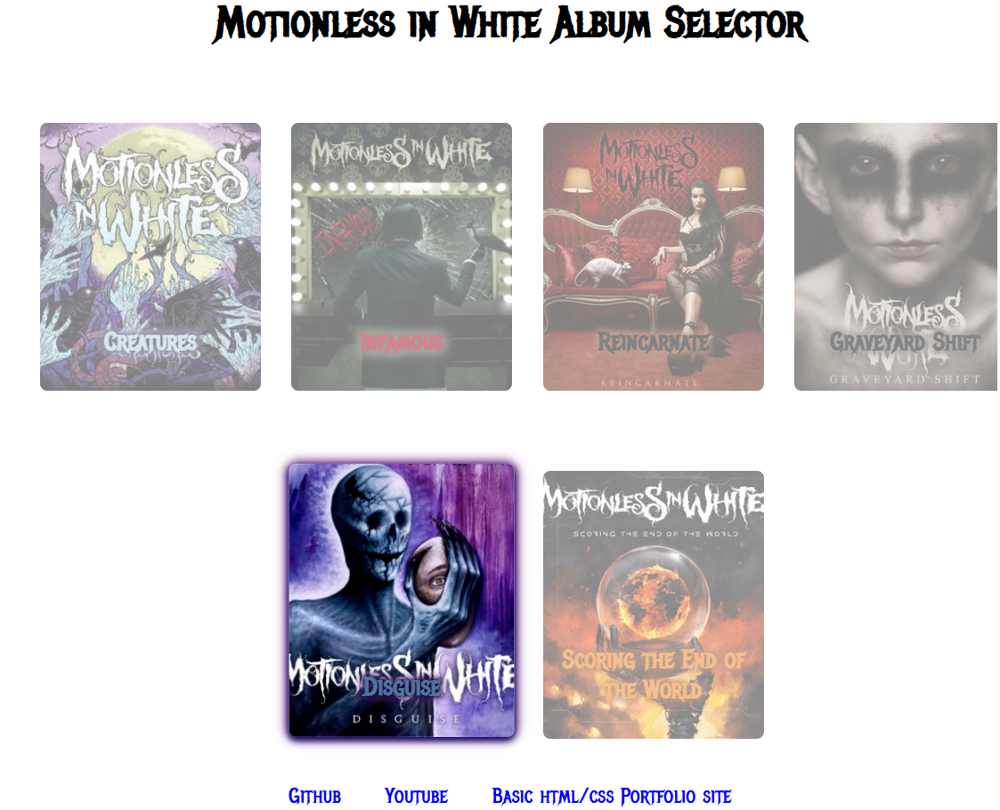
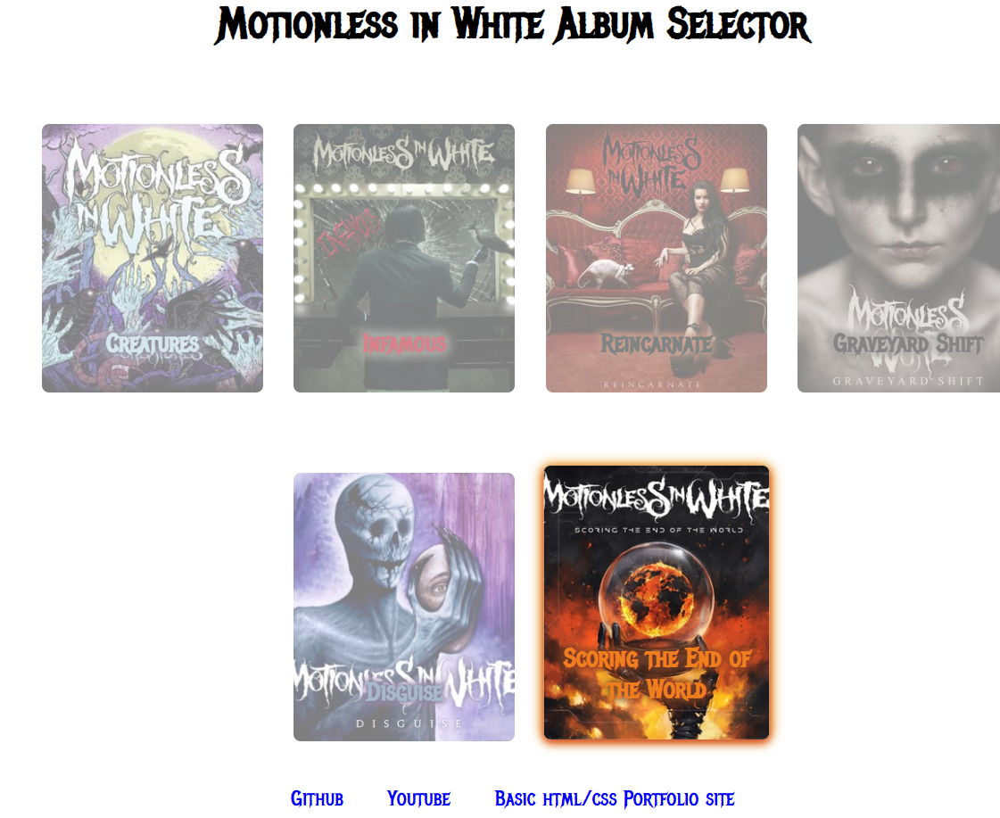

# Motionlesss In White Album Selector

# MIW_ALBUM_SELECT

This project was generated using [Angular CLI](https://github.com/angular/angular-cli) version 19.1.5.

## Using the repo

Select the green "code" dropdown and select SSH.
Copy the url and use command "git clone " followed by the copied link in your terminal
move into the main directory of the project folder and run "ng serve" to run the angular app

## SCREENSHOTS

Default view

Creatures selected

Infamous selected

Reincarnate selected

Graveyard shift selected

Disguise selected

Scoring the end of the world selected

